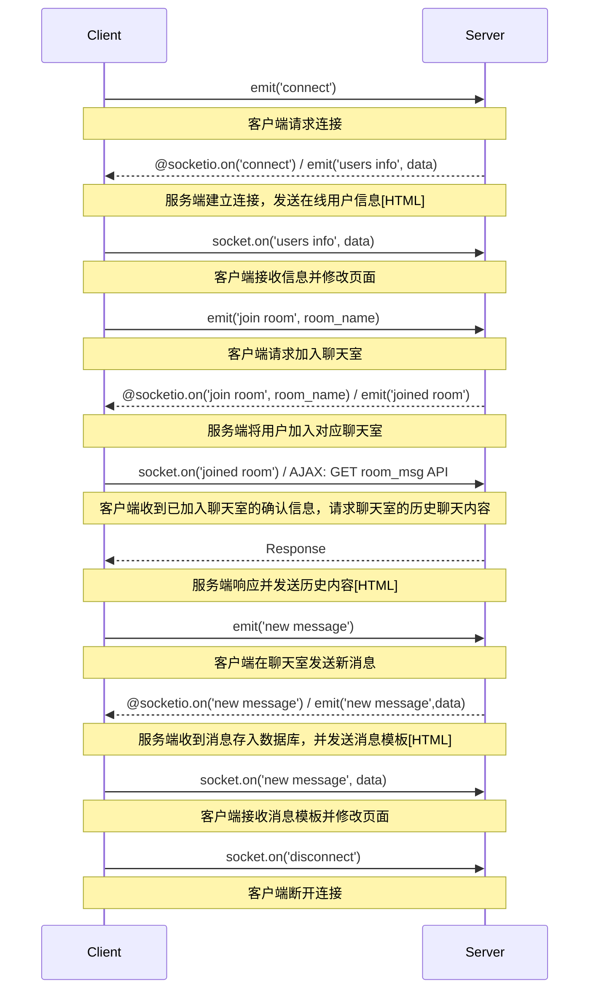
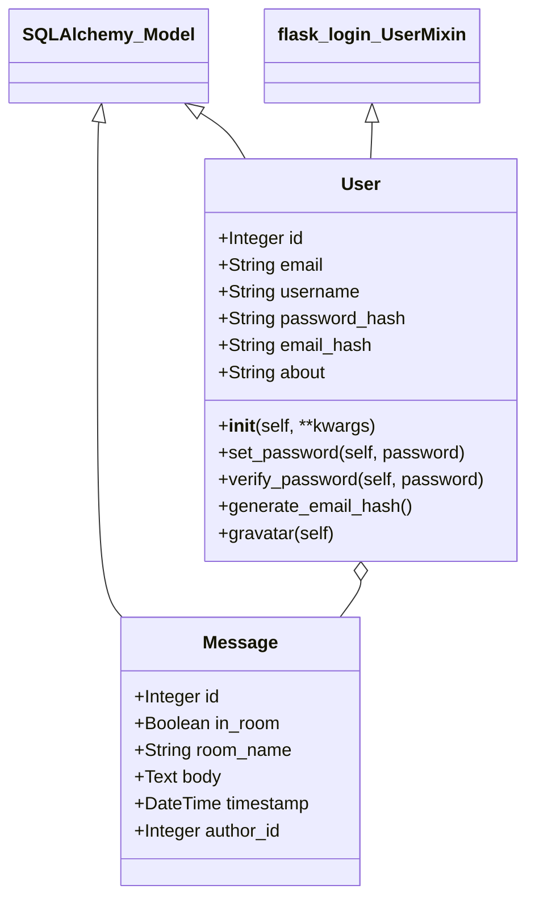

## Intro

[这](https://github.com/magicwenli/SocketIO-Chat)是一个简单的在线聊天网站，注册用户可以和其他在线用户一对一聊天和视频聊天（P2P）。除此之外，用户还可以创建或加入特定名称的聊天室以开展群聊。

<!--more-->


开发项目用到的有：

- python 3.8
- Flask
  - flask_socketio：项目的主要工具，后面细说；
  - flask_sqlalchemy：一个ORM框架，能方便地对数据库进行CRUD操作；
  - flask_bootstrap：Bootstrap支持，简化部分组件的渲染操作；
  - flask_ckeditor：支持更丰富的文本编辑功能；
  - flask_jsglue：在JS中使用Flask命令；
  - flask_login：用户登入管理；
  - flask_moment：渲染消息发送时间；
- Jinja2
- Sqlite3

## Socket IO

### Socket IO 和 AJAX

从功能上来说，Socket IO和AJAX都可以实现客户端和服务端的通信。同时，AJAX和Web Socket（可以说是Socket IO的一个子集）都是HTML5标准中的特性。

在使用过程中，它们大概有几个区别：

- Socket IO 支持全双工通信，也就是建立双向连接后，客户端和服务端都可以向对方发出请求，并取得回复；而AJAX则只能由客户端发出请求，由服务端进行响应。
- Socket IO有Room概念，服务端可以方便地对同一房间的用户进行广播，这个功能由底层自动实现。
- Socket IO中，客户端和服务端通过响应自定义事件来执行指定动作；AJAX中，客户端通过对API的HTTP请求，取得响应后执行对应动作。
- AJAX由于使用HTTP通信，能根据不同需要设置Header，可以发送更有针对性的请求。例如代理缓存请求和带条件的GET请求。
- 由于Socket IO通信时携带的Header更小，似乎在速度上具有一定优势。

### Chatroom中的Socket编程

对于更新速度较快的即时通信应用来说，Socket IO应该是更好的选择。

#### 客户端与服务端的基本交互



#### Join_room()

`python_socketio`使用双重列表管理连接的用户(sid标识)和启用的房间，`flask_socketio`是在前面的基础上继续封装形成的。

```python
    # flask_socketio/__init__.py
    def join_room(room, sid=None, namespace=None):
        socketio = flask.current_app.extensions['socketio']
        sid = sid or flask.request.sid
        namespace = namespace or flask.request.namespace
        socketio.server.enter_room(sid, room, namespace=namespace)
        
    # socketio/server.py
    def enter_room(self, sid, room, namespace=None):
    	namespace = namespace or '/'
        self.logger.info('%s is entering room %s [%s]', sid, room, namespace)
        self.manager.enter_room(sid, namespace, room)
        
    # socketio/base_manager.py
    def enter_room(self, sid, namespace, room, eio_sid=None):
        """Add a client to a room."""
        if namespace not in self.rooms:
            self.rooms[namespace] = {}
        if room not in self.rooms[namespace]:
            self.rooms[namespace][room] = bidict()
        if eio_sid is None:
            eio_sid = self.rooms[namespace][None][sid]
        self.rooms[namespace][room][sid] = eio_sid
```

## 数据库

数据库的控制使用了`flask_sqlalchemy`库，在开发时使用Sqlite进行数据库的管理。由于有ORM作为中介，在发布阶段可以方便地替换为其他数据库。

```python
# SQLite URI compatible
WIN = sys.platform.startswith('win')
if WIN:
    prefix = 'sqlite:///'
else:
    prefix = 'sqlite:////'
SQLALCHEMY_DATABASE_URI = prefix + os.path.join(basedir, 'data-dev.db')
```

### 用户和消息模型

数据库中存放User和Message两张表。

User表中使用`password__hash`增强数据安全性，登录时由`verify_password`，验证密码的正确性。`email_hash`用来从Gravatar获取用户头像，`about`存放用户的个性签名。

Message表同时存放聊天室消息和p2p消息，使用`in_room`来进行判断。将消息存入数据库后，用户聊天时可以看见此前的聊天内容。



## 用户认证

### 注册(Sign up)

### 登录(Log in)


## 尾巴

前一段时间报名了一下前端实习生，面试后感觉自己还欠缺蛮多的。正好有一门网络实验要求编写一个Socket IO通信的小程序，我想可以在这个作业上再发挥创造一些，多收获一些前端开发的经验。也正好可以让自己专注起来，先认真做好一件事吧。
